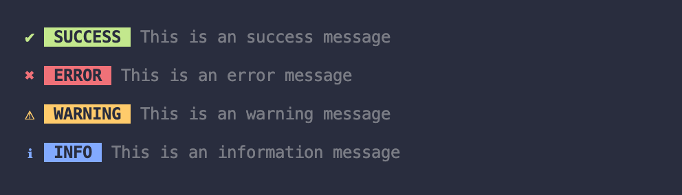

# `tt-cli-alerts`


> CLI Alerts with customizable design for  `success`, `info`, `warning`, `error`, and `custom` alerts. Based on Ahmad Awais course.

<br>
<br>

## 👉 install
```sh
npm tt-cli-alerts
```
<br>

## 👉 usage

<br>
provide message into the desired type of alert:
<br>
<br>




```js
const alert = require('tt-cli-alerts')


alert.success('This is a success message')
//  ✔ SUCCESS  This is a success message

alert.error('This is an error message')
//  ✖ ERROR  This is an error message

alert.warning('This is a warning message')
//  ⚠ WARNING  This is a warning message

alert.info('This is an information message')
 // ℹ INFO  This is an information message

```

<br>
create your own alerts with the `alertFactory`.
<br>
<br>


```js
const { alertFactory } = require('tt-cli-alerts')


// creating only alert name
const foo = alertFactory('foo')
foo('lorem ipsum dolor sit amet')

// creating alert name + color
const bar = alertFactory('bar', '#deaa00')
bar('lorem ipsum dolor sit amet')

// creating alert name + color + icon
const baz = alertFactory('baz', '#00a9bc', '🤟')
baz('lorem ipsum dolor sit amet')


```

<br>

## 👉 API


<br>

### overriding styles
customize existing or your custom alerts.
<br>
<br>


```js

const { warning } = require('tt-cli-alerts')

warning('lorem ipsum dolor sit amet')

warning('lorem ipsum dolor sit amet', {
  icon: '🔥',
  title: 'waaarning',
  color: '#ffa500',
  transparent: true,
})

```

### options

#### > icon

type: `string` <br>
default: `'★'`

#### > title

type: `string` <br>
default: `alertFactory given name`

#### > color

type: `string` <br>
default: `#fff`

#### > transparent

type: `bool` <br>
default: `false`


#### > mesage

type: `string` <br>
default: `Message cannot be empty` (Error message)

<br>


## 👉 Mantainers

- [Tommy Traddles](https://github.com/TommyTraddles)